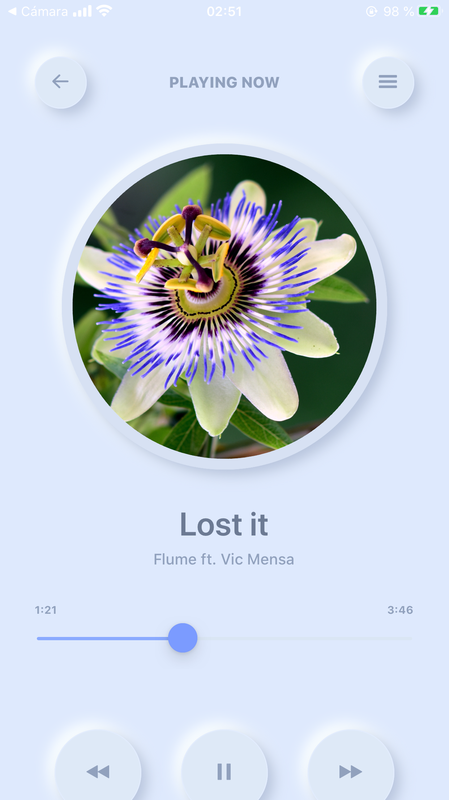

# Neumorphistic Music Player in React Native
You can find the tutorial followed to create the music player [here](https://youtu.be/VPwsKUwZPao).

This is the app running on an iOS device:  

NOTE: The custom drop shadows won't work on an Android device.